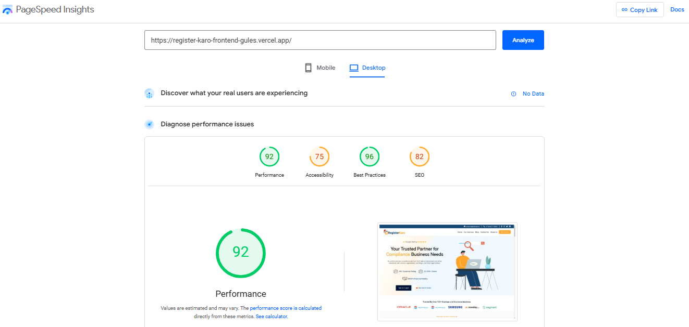
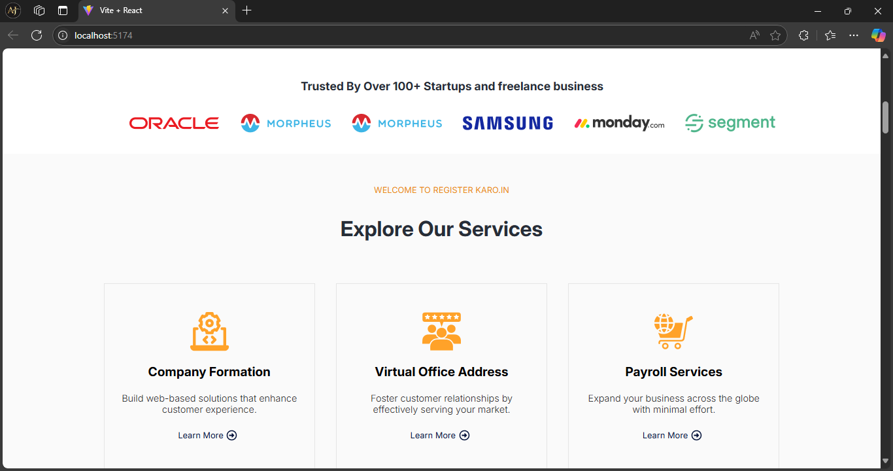
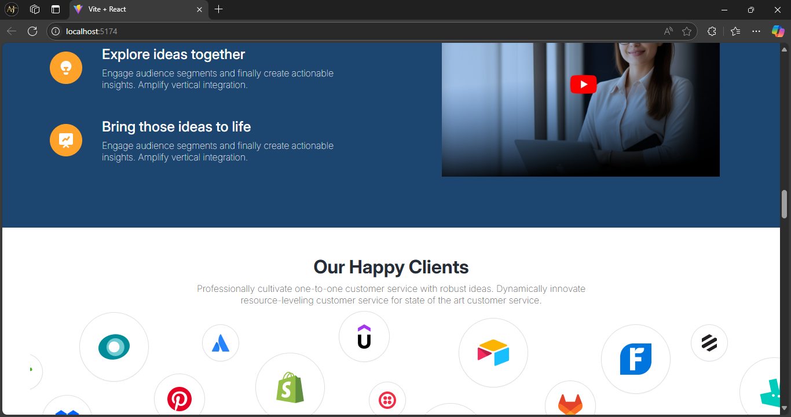
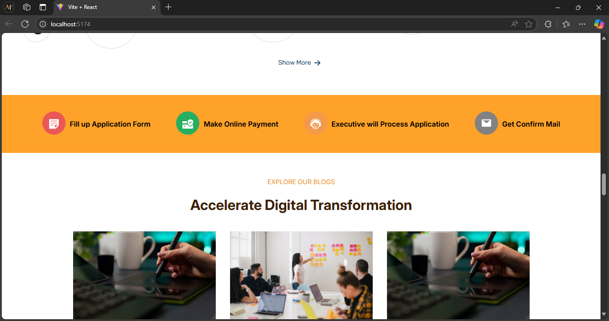
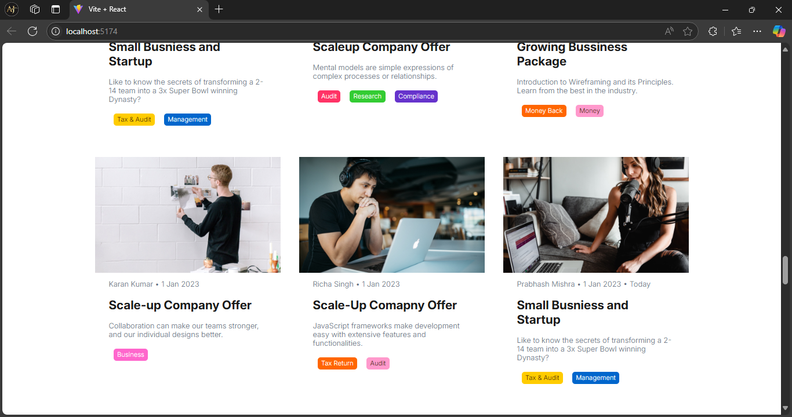

# Register Kro - Home Page

This repository contains the implementation of the home page for the **Register Kro** project, based on the provided Figma design. The project is built using **React** with **Vite** as the build tool.


## Features

- Responsive and modern home page design.
- Pixel-perfect UI matching the provided Figma design.
- Optimized for performance and fast rendering using Vite.
- Modular and reusable React components.


## Tech Stack

- **React**: A JavaScript library for building user interfaces.
- **Vite**: A modern frontend build tool providing fast development and optimized production builds.
- **CSS**: For styling the components.


## Project Setup

### Prerequisites

Ensure you have the following installed on your system:

- [Node.js](https://nodejs.org/) (version 14 or later)
- [npm](https://www.npmjs.com/) or [yarn](https://yarnpkg.com/)

### Installation Steps

1. Clone the repository:
   ```bash
   git clone <repository-url>
   cd registerKaro-Task

2. Install Dependencies:
   npm install

3. Start the Development Server:
   npm run dev

4. Open the application in your browser:
   http://localhost:5173


# Development Process
1. Analyze the Figma Design: Studied the design to break it into reusable components and structure.
2. Component Development: Created modular and reusable components for the UI.
3. Styling: Implemented responsive design using CSS/SCSS to match the Figma design.
4. Optimization: Used Vite's fast refresh and optimized builds for efficient development and deployment.

# Deployment
  npm run build

# ScreenShots






